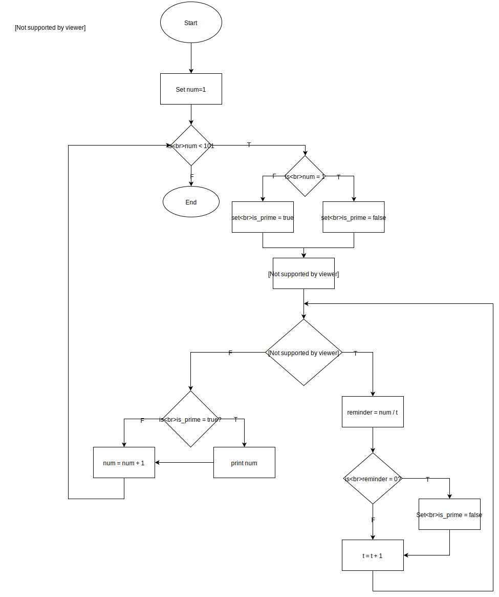

# Q1	
**Research the development of the internet from 1980 to today. You must describe at least FIVE key events in the development of the internet. You can refer to events, people of significance, or technologies and how they have changed over time.	300 - 500**

---
The internet development started nearly fifty years back. In 1969 US military funded a research network called ARPANET. Many of the researchers who were involved in development of ARPANET, were later involved in development of the other technologies that lead to the evolution of the Internet. For example: Leonard Kleinrock, invented packet switching for passing messages between network devices. Vinton Cerf and Robert Kahn built TCP/IP protocol which is the major protocal for handling network traffic across Internet and, Ray Tomlinson built network email technology.

- 1984, the Internet's Domain Name System was created to match complex IP addresses with easy-to-remember names ending in extensions such as .com, .org, .edu, .gov, .mil and country codes including for example .de for Germany. 

- 1989, @The World (http://world.std.com/) became the first commercial Internet Service Provider which provided access to the internet for the general public via dial-up network service.

- 1990, Tim Berners-Lee created the World Wide Web which used HTML format to publish the information on the Internet. 

- In 1993, computer science student Marc Andreessen created the first popular Web browser, known as Mosaic. The Mosaic browser contributed to very fast spread of the World Wide Web. After introduction of the Mosaic browser the number of the pages and the websites hosted on internet increased manifold.

- By 1987, the number of hosts on internet exceeded 20,000 nodes at the same time Cisco shipped it's first router.

- In 1997, the 802.11 standard (the standards that makes WiFi feasible) was established. Vic Hayes has been attributed as the "father of Wi-Fi" as a result of him chairing the IEEE committee that was involved in creating the 802.11 standards. At about the same time, Commonwealth Scientific and Industrial Research Organisation (CSIRO) of Australia invented a chip that vastly improved the quality of the WiFi signal. CSIRO attributed Dr. John O’Sullivan, Dr. Terry Percival, Mr. Diet Ostry, Mr. Graham Daniels, and Mr. John Deane for invention of the technology: .

- In 1998, the Internet Protocol version 6 was introduced, to allow for future growth of Internet Addresses. The most widely used protocol is still version 4. IPv4 uses 32-bit addresses that provides about 4.3 billion unique addresses whereas IPv6, with 128-bit addresses, creates 3.4 x 1038 distinct addresses, or 340 trillion trillion trillion addresses.

The information mentioned above is mainly aquired from following sources
(en.wikipedia.org)[https://en.wikipedia.org/wiki/Wi-Fi]
(thoughtco.com)[https://www.thoughtco.com/who-invented-wifi-1992663]
(livescience.com)[https://www.livescience.com/20727-internet-history.html]

# Q2
**Define the features of the following technologies that are essential in terms of the development of the internet:**

  - packets
  - IP addresses (IPv4 and IPv6)
  - routers and routing
  - domains and DNS


**Explain how each technology has contributed to the development of the internet.	50 - 100 words per dot point**
---
  1. _**Packets**_
    The information that is sent over the Internet is sent in form of Packets. Packets are nothing but small pieces of information that is created by breaking the message that is being communicated. The network that send information in form of packets are called **packet switched networks**.

    Each Packet contains small part of the message and metadata about the message that helps the message to be delivered and rebuilt at the destination. Most network packets are split into three parts as described below:
    
    
*Image source: https://computer.howstuffworks.com/question5251.htm*
    
  - **Header** 
  The header describes the information that is being carried by the packet. 
  - **Payload** - The payload is actual small peice of the message that is being carried from sender to the receiver. It is also called the body or data of a packet.

  - **Trailer** - The trailer is used to indicate end of the message in a packet. Sometimes it may also be used for error checking. 

2. _**IP addresses (IPv4 and IPv6)**_ An Internet Protocol address (IP address) is a logical numeric address that is assigned to every single computer, printer, switch, router or any other device that is part of a TCP/IP-based network. It is used to uniquely identify every node in the network.

    There are two versions of the Internet Protocol that are in common use in the Internet today. The original version of the Internet Protocol that was first used in 1983, that is Internet Protocol version 4 (IPv4). The rapid expansion of internet lead to exhaustion of IPv4 address space available for assignment to Internet service providers and end user organizations, and that lead the **Internet Engineering Task Force (IETF)** to explore new solutions to create larger address space capability in the Internet. The result was a redesign of the Internet Protocol which became eventually known as Internet Protocol Version 6 (IPv6) in 1995. 

- *IPv4 addresses*
  The traditional IP Address (known as IPv4) uses a 32-bit number to represent an IP address. An IP address is written in "dotted decimal" notation, which is 4 sets of numbers separated by period each set representing 8-bit number ranging from (0-255). An example of IPv4 address is 216.3.128.12.

  An IPv4 address is divided into two parts: network and host address. The network address determines how many of the 32 bits are used for the network address and the remaining bits are used for the host address. The host address can further divided into subnetwork and host number.

  As mentioned earlier, IPv4 addresses is 32-bit number which means it is capable of providing roughly 4 billion unique numbers, and hence IPv4 addresses has run out by the year 2011 as more devices are connected to the IP network.
- *IPV6 addresses* In IPv6, the address size is increased from 32 bits in IPv4 to 128 bits. This much of extra bits can provide approximately 3.403×1038 different combinations of addresses. This is deemed sufficient for the foreseeable future.

  The intent of the new design was not to provide just a sufficient quantity of addresses, but also redesign routing in the Internet by allowing more efficient aggregation of subnetwork routing prefixes.

  3. _**Router and Routing**_ 
  - A *Router* is a hardware device designed to receive, analyze and move incoming packets to another network. It may also be used to convert the packets to another network interface, drop them, and perform other actions relating to a network.

    Routers can analyze the data being sent over a network, change how it is packaged, and send it to another network or over a different network. For example, routers are commonly used in home networks to share a single Internet connection between multiple computers.
  - *Routing* refers to establishing the routes that data packets take on their way to a particular destination. Routing can  take place within a proprietary network or over the internet. 

    In general, routing involves the network topology, or the setup of hardware, that can effectively relay data. Standard protocols help to identify the best routes for data and to ensure quality transmission. Individual pieces of hardware such as routers are referred to as "nodes" in the network. Different algorithms and protocols can be used to figure out how to best route data packets, and which nodes should be used.

  4. _**Domains and DNS**_
  - The term *Domain* can refer either to a local subnetwork or to descriptors for sites on the internet.
    - *Local subnetwork domains*: On a local area network (LAN), a domain is a subnetwork made up of a group of clients and servers under the control of one central security database. Within a domain, users authenticate once to a centralized server known as a domain controller, rather than repeatedly authenticating to individual servers and services. Individual servers and services accept the user based on the approval of the domain controller.
    - *Internet domains*: On the internet, a domain is part of every network address, including website addresses, email addresses, and addresses for other internet protocols such as FTP, IRC, and SSH. All devices sharing a common part of an address, or URL, are said to be in the same domain.
    
      To obtain a domain, you must purchase it from a domain registrar. Internet domains are organized by level. Most people are familiar with the Top Level Domains (TLDs) of .com, .edu, .net, and .org. TLDs are the most general and basic part of the URL. There are actually many top level domains.  Every country is assigned one; for example: for Australia ".au" is the contry code for the top level domain.
  
  - The *Domain Name System (DNS)* translates internet domains and hostnames to IP addresses and vice versa. On the internet, DNS automatically converts between the names typed in the address bar of a web browser to the IP addresses of web servers hosting those sites. Larger corporations use DNS to manage a company intranet. Home networks use DNS to access the internet but do not use it to manage the names of home computers.

    DNS is a client/server network communication system. DNS clients send requests to and receive responses from DNS servers. Requests containing a name that results in an IP address being returned from the server are called forward DNS lookups. Requests that contain an IP address and result in a name, called reverse DNS lookups, are also supported. DNS implements a distributed database to store this name and last-known address information for all public hosts on the internet.
# Q3
**Define the features of the following technologies that are essential in terms of the development of the internet:**
  - TCP
  - HTTP and HTTPS
  - web browsers (requests, rendering and developer tools)

  ---
  

**Explain how each technology has contributed to the development of client and server communication over the internet	50 - 150 words for each technology**

---
  
- TCP
    
    Transmission control protocol (TCP) is a network communication protocol designed to send data packets over the Internet.

    Transmission Control Protocol is one of the most used protocols in digital network communications and is part of the Internet protocol suite, commonly known as the TCP/IP suite. Primarily, TCP ensures end-to-end delivery of data between distinct nodes. TCP works in collaboration with Internet Protocol, which defines the logical location of the remote node, whereas TCP transports and ensures that the data is delivered to the correct destination.

    Before transmitting data, TCP creates a connection between the source and destination node and keeps it live until the communication is active. TCP breaks large data into smaller packets and also ensures that the data integrity is intact once it is reassembled at the destination node.

- HTTP and HTTPS
  
    HTTP and HTTPS are both responsible for providing a channel where data can be transmitted between a user's device and a web server so that normal web browsing functions can take place.

    HTTP stands for HyperText Transfer Protocol, and it's the network protocol used by the World Wide Web that lets you open web page links and jumps from one page to the next across search engines and other websites.

    When a web page that uses HTTP is requested by a user, the web browser uses the HyperText Transfer Protocol (over port 80) to request the page from the webserver. When the webserver receives and accepts the request, it uses the same protocol to send the page back to the client.

    This protocol is the foundation for large, multi-functioning, multi-input systems — like the web. The web as we know it wouldn't function without this bedrock of communication processes, as links rely on HTTP in order to work properly.

  However, HTTP sends and receives data in plaintext. This means that when browsing a website that uses HTTP, anyone listening in on the network can see everything that's being communicated between the client browser and the server. This includes passwords, messages, files, etc.

  HTTPS is very similar to HTTP, with the key difference being that it is secure, which is what the **s** at the end of HTTPS stands for.

  HyperText Transfer Protocol Secure uses a protocol called SSL (Secure Sockets Layer) or TLS (Transport Layer Security), which essentially wraps the data between the client browser and the server in a secure, encrypted tunnel over port 443. This makes it much harder for packet sniffers to decipher, unlike HTTP.

  TLS and SSL are especially useful when shopping online to keep financial data secure, but is also used on any website that requires sensitive data (e.g., passwords, personal information, payment details).

  Another benefit of HTTPS over HTTP is that it's much faster, meaning that web pages load quicker over HTTPS. The reason for this is because HTTPS is already understood to be secure, so no scanning or filtering of data has to take place, resulting in less data being transferred and ultimately quicker transfer times.


- web browsers (requests, rendering and developer tools)

  A web browser is a software program that allows a user to locate, access, and display web pages. Browsers are used primarily for displaying and accessing websites on the internet.

  The web browser displays a website by sending request the web server that is hosting the website in response the web server sends the page requested in by the browser. The page is sent in form of HTML markup which is then interpreted and rendered by the browser. 

  Most of the modern browser comes with capability to debug the rendering of web page this is in form of developer tools. The developer tools can be used by developers to debug the issues with HTML, CSS or javascript associated with the page.

# Q4
**Identify THREE data structures used in the Ruby programming language and explain the reasons for using each.	50 - 100 words on each data structure**
---
1. Arrays:

    Ruby arrays are ordered, integer-indexed collections of any object. Each element in an array is associated with and referred to by an index.

    Array indexing starts at 0, as in C or Java. A negative index is assumed relative to the end of the array --- that is, an index of -1 indicates the last element of the array, -2 is the next to last element in the array, and so on.

    Ruby arrays can hold objects such as String, Integer, Fixnum, Hash, Symbol, even other Array objects. Ruby arrays are not as rigid as arrays in other languages. Ruby arrays grow automatically while adding elements to them.

    Arrays are generally used to store list of data into a program.
2. Hash:
    
    A Hash is a collection of key-value pairs like this: "employee" = > "salary". It is similar to an Array, except that indexing is done via arbitrary keys of any object type, not an integer index.

    The order in which you traverse a hash by either key or value may seem arbitrary and will generally not be in the insertion order. If you attempt to access a hash with a key that does not exist, the method will return nil.

    The hashes are mainly used to retrieve the values associated with a key without traversing through entire collection.

3. Stacks:
    
    A Stack is a form Last In First Out (LIFO) storage. It is similar to stack of plates, the one that is put on top is the last one to be placed but the first one to be used. 

    Stacks has many practical applications. In system programming they are used to keep track of function calls. When the function calls another functions stack helps to establish which function needs to be executed first to complete execution of the caller.

    In Ruby stack can be easily implemented using arrays and push and pop methods. Array is acts as list of items. Push is used to add items at the end of the list and Pop is used to remove item from end of the list.
    

# Q5
**Describe the features of interpreters and compilers and how they are different.	100 - 200 words on each way code is executed.**
---
1. Compiler

A compiler is a software program that transforms high-level source code that is written by a developer in a high-level programming language into a low level object code (binary code) in machine language, which can be understood by the computer processor. 
- Compiler analyses entire source code and then generates the binary code if there is no error.
- Compilation process invovles following four steps Scanning, Lexical Analysis, Syntactic Analysis, Semantic Analysis.

2. Interpreter

An interpreter is a computer program that directly executes instructions written in a programming or scripting language, without requiring them previously to have been compiled into a machine language program. As a result of this runtime interpretation, an interpreted program executes more slowly and consumes more resources than an equivalent standalone machine code executable would. 

The difference between an interpreter and a compiler is given below:

| Interpreter                                                                                                      | Compiler                                                                                                                                   |
|------------------------------------------------------------------------------------------------------------------|--------------------------------------------------------------------------------------------------------------------------------------------|
| The machine language code generated by interpreter is executed immediately after the code is interpreted.        | The machine language code generated by the compiler is not executed immediately but stored on computer hard drive as an executable binary. |
| Translates program one statement at a time.                                                                      | Scans the entire program and translates it as a whole into machine code.                                                                   |
| It takes less amount of time to analyze the source code but the overall execution time is slower.                | It takes large amount of time to analyze the source code but the overall execution time is comparatively faster.                           |
| No intermediate object code is generated, hence are memory efficient.                                            | Generates intermediate object code which further requires linking, hence requires more memory.                                             |
| Continues translating the program until the first error is met, in which case it stops. Hence debugging is easy. | It generates the error message only after scanning the whole program. Hence debugging is comparatively hard.                               |
| Programming language like Python, Ruby use interpreters.                                                         | Programming language like C, C++ use compilers.                                                                                            |

# Q6
**Identify TWO commonly used programming languages and explain the benefits and drawbacks of each.	200 - 400 words on each language**
---
1. C# is one of the languages supported by Microsoft .NET framework. The C# language is the preferred architecture for backend programming and automation in Windows environments. 
- Benefits:
  - Its C-style syntax is much more popular with programmers who are used to languages such as Java or C++. Due to this it is very easy to adopt programmers who have experience with other programming languages.
  - It integrates well with Windows. You don't need any special configurations to get a C# program to run in your Windows environment. Whether it's a web application, a Windows service, or a desktop app, C# programs are easily deployed on the network. As long as the target server or workstation supports .NET, your C# program deployment should be a smooth transition from development to production.
  - C# is a compiled language, which means that the code stored on a public-facing server is in binary form. If the server gets hacked, the hacker doesn't automatically have access to the source code, with C#, the hacker must decompile or "crack" the software before the critical components of the program can be exploited.
- Drawbacks
  - Eventhough compiling provides advantages it has its drawbacks as well which are inherited by C# being the compiled language. For example: Since the source code must be compiled each time a change is made, the whole application is required to be deployed again. This often leads to added bugs if a minor change isn't thoroughly tested.
  - Since C# is a part of the .NET framework, the server running the application must support the .Net ecosystem.

2. C Programming
- Benefits
  - Faster app execution: C compiler convets the source code into machine level binary code. This results in efficient program execution since the system can execute the application without need for additional run time to execute the application.
  - Ability to run on minimum hardware: The resultant binary from C program is very light weight application which can run with system with minimal resources. Hence C programming is very useful to create firmware for smart devices.
- Drawbacks
  - Does not support OOPS: C programming language does not support oops (Object Oriented Programming) features which leads to a lot of difficulty in maintaining a large code base.
  - No run time type checking: A C program does not check if valid data type is assigned to a variable or another type during execution of a program instead it does automatic type conversion. This leads to undesired results and complex bugs if programmer is not mindful of the above fact.
  - No Exception Handling: The C compiler checks for syntax errors however there is no provision to handle run time errors. This results in application crashing suddenly if the programmer does handle each run time error.
  - Lack of Garbage Collection: In C programming dynamic memory management is responsibility of the programmer. If the application requests for memory from heap it is responsibility of the programmer to release it at the end of the execution of the program. If memory management is not correctly implemented by a programmer the system may not be able to utilize the resources efficiently and it will result in overall performance degradation of computer system until system restart. 

# Q7
**Identify TWO ethical issues from the areas below and discuss the extent to which an IT professional is ethically responsible in terms of the issue.**

**List of topics containing ethical issues:**
  - access to a user’s personal information (medical, family, financial, personal attributes such as sexuality, religion, or beliefs)
  - intellectual property, copyright, and acknowledgement.
  - criminal acts such as theft, fraud, trafficking and distribution of prohibited substances, terrorism
  - GPS tracking data and other types of metadata, MAC addresses, hardware fingerprints
  - freedom of thought, conscience, speech and the media
  - aggressive sales and marketing practices designed to mislead and deceive consumers
  - trading of shares on the stock exchange OR crypto-currencies

**For each ethical issue identify a source of legal information relating to the ethical issue and discuss whether the law is helpful in assisting a developer to act in an ethical way.**

**Conduct research into a case study of ONE of the ethical issues you have chosen discuss how an ethical IT professional should respond to the case study and how they might mitigate or prevent ethical breaches.	200 - 400 words for each ethical issue**

---
1. Access to a user's personal information

    In information edge IT professionals collectively can and does have access to user's personal information in ways general masses are not even aware of. For example we as a user of social media hand out a lot of personal information such as Birth Dates, Legal Names, Phone Numbers to companies that generally we do not want people around us to know. This information can be used by the companies to formulate patterns of preferences for individuals and then use this patterns to influence spending behaviour.

    Many of us might have recognized that as soon as we search for phrases on internet for some information for example a tech tutorial and then when viewing videos through one of the free video streaming platform and we start getting ads for a popular online tech training platform. If the same thing would have been done by a co-worker who overheard the conversation that a colleague planning to buy a product and then another co-worker advising a specific brand without aknowledging that s/he has commercial interest in that brand it would have been described as unethical however the same pattern is being exhibited by tech companies by presenting advertisements of products matching the keywords that a user searched for in recent future.

    As an IT professional one is ethically responsible to look at the personal data of users and use it for personal gains. However they cannot be responsible for crafting parts of the algorithms that are used by companies to analyse user data and use it or sell it for profits. 

2. Freedom of thought, conscience, speech and the media

    In today's social media age people share their views more openly believing they can remain annonymous even if their views does not confirm to the majority views. Feeling of being annonymous encourages individuals to express ideas or opinions without being judged by the people around them. 

    Freedom of thought is not interpreted by different societies and regimes in different ways. For example, speaking against government policies can be termed as "Acting against national interest" in some part of the world or as "Holding government executives accountable" in another.

    This leads to ethical dielema for IT professionals specially when views are contradictory that of individuals compared to that of the other culture.

    **Case study: Freedom of thought, conscience, speech and the media**

    The article referred to here is about [Google Employees Protest Secret Work on Censored Search Engine for China](https://www.nytimes.com/2018/08/16/technology/google-employees-protest-search-censored-china.html)

    This article discusses about internal dissent of google employees about reports of Google secretly building a censored search engine for China. The employees being worried about they might be part of the product which does not follow their concience and demanding the company to be more transparent about what repurcussions of the project they are working on on larger context.

    It also discusses about how Google's outspoken workforce has made the company change their strategy and not renew contract with Pentagon for AI based weaponery improvement program.

    Therefore, as an IT professional we should also remember the fact that before being an IT perons we are human beings and the idea of freedom of thought and conscience is not limited in personal context but it is part of professional context as well.


# Q8
**Explain control flow, using an example from the Ruby programming language	100**

---

Control flow is one of the feature of the Ruby language to control which part of the code would run based on a specific logical condition.

Control flow structures are required to allow the application to make decisions based different situation.

There are two types of control flow structures
1. Selection: This kind of control flow structure is used for making decision on executing a specific set of statements  in the given program. It involves evaluating one or several logical expression(s) and then executing a certain branch of code based outcome of evaluation of the logical expression.

    Follwing are selection structures available in Ruby
    - if / elsif / else
    - unless / else
    - case / when / else
2. Repetition/Loops: This kind of control flow structure is used for performing repeting actions based on a condition. 

    Following are loop structures available in Ruby
    - while
    - until
    - for

For example in Ruby if/elsif/else is used to execute a specific branch of code when a condition is evaluated to be true or false. In an application where task is to find largest of three numbers if/elsif/else can be used as follows.
```
number_one = 100
number_two = 1000
number_three = 10000

largest_number = 0

if (number_one > number_two && number_one > number_three)
  largest_number = number_one
elsif (number_two > number_three)
  largest_number = number_two
else
  largest_number = number_three
end
```
# Q9
**Explain type coercion	100**

---
Most of the programming languages support many data types and converting values of a data type to another supported data type. This type conversion is supported mainly in two ways
1. *Explicit Conversion*: Explicit type conversion occurs when the application contains and explicit instruction to convert data type of a value to another data type. For example in Ruby to_i method is supported by String class to convert string values to Integer. This way of type conversion is called explicit conversion.
2. *Implicit Conversion/Type Coercion*: In certain situations when the system recognises that the current instruction being executed involves more than one data type and they are compatible with each other then the the system attempts to automatically convert the values of the data type based on rules of programming language. This implicit type conversion is also called **Type Coercion**. 

For example for a division operation in Ruby if one of the operand is a Float value and another is an Integer, the Ruby Interpreter automatically converts the Integer operand to a Float value and then performs the division operation and hence the result of the operation is a Float value.    

# Q10
**Describe the data types recognised by the Ruby programming language. In your description you should give example code which uses each data type, and include the name of the Ruby classes which represent each data type.	100**

---
Ruby mainly recognizes following data types
1. Numbers
This data types is used for storing numeric data into the variables.
There are two types of Numbers supported by Ruby

    - Integer: This data type is used to store whole numbers only. An integer value represented by **Integer** class in ruby.
 
      for example following ruby code creates an Integer variable

      ```
      int_value = 1
      ```
    - Float: This data type is used to store decimal numbers. A decimal value is represented by **Float** clas in Ruby.

      for example following ruby code creates a Float varible

      ```
      float_value = 1.0
      ```
2. Boolean:
Boolean type can have one two possible values true or false. A **true** value is represented by **TrueClass** and a **false** value is represented by **FalseClass** in Ruby.

    For example following Ruby code creates a variable of type TrueClass
    ```
    boolean_value = true
    ```

3. Strings:
In Ruby a string is a sequence of characters enclosed within quotes (**'**) or double quotes (**"**). They are represented by **String** class in Ruby. String values are very useful for giving feedback from application to the user.

    For example following Ruby code prints a string message on user screen to input a integer value.

    ```
    puts "Please enter a Integer value"
    ```
4. Hashes:
In ruby a Hash is a collection of key and value pairs. The values stored in this type of collection can be retrieved by the key associated with the collection. Hashes are represented by the Ruby class **Hash**.

    A Hash is declared by enclosing key value pair between curly braces and key-value pairs can be declared by 
    placing key and value seperated by a double arrow 

    **{ key => value }**

    The key in key-value pair can be of data type String or Symbol. Whereas the value in the pair can be of any type of objects allowed in Ruby.

    For example below code produces a Hash with key as name of the food item and associated string value as the category.

    ```
    foods = {
      "Lettuce" => "Vegetables",
      "Apples" => "Fruits",
      "Almond" => "Nuts",
      "Mutton" => "Meats",
      "Tuna" => "Fish"
    }
    ``` 
5. Arrays
In Ruby array is nothing but list of values. The values can be any object of allowed types in Ruby. An array is represented by the Ruby class **Array**.

    An array can be declared by enclosing comma seperated list of values between square brackets **[ value1, value2, value3, ... ]** The values in an array can be retrieved using its position in the list. The position or array items is called **Index** which start from 0.

    For example following Ruby code creates an array of string representing movies and print the first item in movies array ("Star wars").

    ```
    movies = ["Star wars", "The Dark Knight", "The Godfather", "Titanic", "Gladiator"]
    p movies[0]
    ```
6. Symbols:
In ruby strings can be stored at a unique location using Symbols. Symbols are light weight way of represting and storing strings at a unique location. Once a symbol is created they are always retrieved from the same memory location everytime the symbol referenced next time in the application. The symbol values are represented by **Symbol** class.

    A symbol can be created by prefixing colon **:** in front of any string but without quotes. For example below Ruby code generates a Symbol **Gladiator** and stores into a variable movie_name

    ```
    movie_name = :Gladiator
    ```

# Q11
**Here’s the problem: "There is a restaurant serving a variety of food. The customers want to be able to buy food of their choice. All the staff just quit, how can you build an app to replace them?"**
  - Identify the classes you would use to solve the problem
  - Write a short explanation of why you would use the classes you have identified	100
---
1. MenuItem: This class can be used for storing details of each item that goes to the menu. The item can have properties such as cousine, price, title, description, image.
2. Menu: When a customer wants to make an order it can be ordered only from list of dishesh that is served by the restaurent. Menu class can be used to store all the dishes served by the restaurent as a collection of MenuItem objects
It can have methods such as add Menu Item, remove Menu Item, View All Menu Items, Pick Menu Item etc...
3. Order: This class can be used for storing collection of Order Details along with Customer Details, order date & time, order number, total amount.
4. OrderDetail: This class would provide details of each Menu item associated with an order along with quantity, customer comments, price per item, and total price for each line item.
5. CustomerDetails: This class can be used to record details of the customer such as Name, contact details etc.

# Q12
**Identify and explain the error in the following code that is preventing correct execution of the program**
```
celsius = gets
fahrenheit = (celsius * 9 / 5) + 32
print "The result is: "
print fahrenheit
puts "."
```
---
When above code is executed it gives following error "n `<main>': undefined method `/' for "15\n15\n15\n15\n15\n15\n15\n15\n15\n":String (NoMethodError)"

The reason for above error is that the value stored in celsius variable is a string value instead of an integer or float. The root cause of the issue is when user input is stored in celsius variable through gets method, it is not converted into an integer or a float.

The issue can be resolved by storing user input into a temporary variable say "user_input" and then validating whether the user input is a numerical value then parse the user_input into a float and storing it into celsius variable else dispay an error "Invalid value"

```
user_input = gets.chomp
celsius = nil

begin
    celsius = Float(user_input)
rescue ArgumentError => e
    puts "Invalid user input. A numeric value is expected."
end

if (celsius != nil)    
    fahrenheit = (celsius * 9 / 5) + 32
    print "The result is: "
    print fahrenheit
    puts "."
end
```


# Q13
**The following code looks for the first two elements that are out of order and swaps them; however, it is not producing the correct results. Rewrite the code so that it works correctly.**

```
arr = [5, 22, 29, 39, 19, 51, 78, 96, 84]
i = 0
while (i < arr.size - 1 and arr[i] < arr[i + 1])
  i = i + 1 end
puts i
arr[i] = arr[i + 1]
arr[i + 1] = arr[i]
```

---
```
arr = [5, 22, 29, 39, 19, 51, 78, 96, 84]
i = 0
while (i < arr.size - 1 and arr[i] < arr[i + 1])
  i = i + 1 
end
puts i

# first store arr[i] in to a temporary variable
temp = arr[i]

# swap  arr[i] with arr[i+1]
arr[i] = arr[i + 1]

# place original value of arr[i] that was stored in temp into arr[i+1]
arr[i + 1] = temp

p arr
```

# Q14
**Demonstrate your algorithmic thinking through completing the following two tasks, in order:

  i. Create a flowchart to outline the steps for listing all prime numbers between 1 and 100 (inclusive). Your flowchart should make use of standard conventions for flowcharts to indicate processes, tasks, actions, or operations

  ii. Write pseudocode for the process outlined in your flowchart**

---
A. Flow Chart


B. Pseudo Code
- Initiliaze a variable num to 1
- For each value of num, perform following steps until num is 101
  - if num is equal to 1 initialize is_prime to false otherwise true
  - Initialize a temporary variable t to 2
  - When t is less than num and is_prime is true perform following steps
    - Find reminder by dividing num by t
    - If reminder is zero set is_prime to false
    - Increment value of t by 1
  - If value of is_prime is true print num
  - Increament value of num by 1

# Q15
**Write pseudocode OR Ruby code for the following problem:**

**You have access to two variables: raining (boolean) and temperature (integer). If it’s raining and the temperature is less than 15 degrees, print to the screen "It’s wet and cold", if it is less than 15 but not raining print "It’s not raining but cold". If it’s greater than or equal to 15 but not raining print "It’s warm but not raining", and otherwise tell them "It’s warm and raining".**

---
```
def weather_message raining, temprature
    msg = ""
    if (raining)
        msg = temprature < 15? "It’s wet and cold" : "It’s warm and raining"
    else
        msg = temprature < 15? "It’s not raining but cold" : "It’s warm but not raining"
    end
    return msg
end
```
# Q16
**An allergy test produces a single numeric score which contains the information about all the allergies the person has (that they were tested for). The list of items (and their value) that were tested are:**

  - eggs (1)
  - peanuts (2)
  - shellfish (4)
  - strawberries (8)
  - tomatoes (16)
  - chocolate (32)
  - pollen (64)
  - cats (128)

**So if Tom is allergic to peanuts and chocolate, he gets a score of 34.**

**Write a program that, given a person’s score can tell them:**

a. whether or not they’re allergic to a given item

b. the full list of allergies.

---
```
# An allergy test produces a single numeric score which contains the information about all the allergies the person has (that they were tested for). The list of items (and their value) that were tested are:

# eggs (1)
# peanuts (2)
# shellfish (4)
# strawberries (8)
# tomatoes (16)
# chocolate (32)
# pollen (64)
# cats (128) So if Tom is allergic to peanuts and chocolate, he gets a score of 34.
# Write a program that, given a person’s score can tell them:

# a. whether or not they’re allergic to a given item

# b. the full list of allergies.

allergies = {
    "1": "eggs",
    "2": "peanuts",
    "4": "shellfish",
    "8": "strawberries",
    "16": "tomatoes",
    "32": "chocolate",
    "64": "pollen",
    "128": "cats",
    "256": "dogs"
}

def get_name invalid_input=false
    if invalid_input
        puts "Did not get your name. Please try again."
    end
    print "Please enter your name: "
    return gets.chomp
end
user_name = get_name
while user_name == ""
    user_name = get_name true
end

def allergies_list(allergies, invalid_input=false)
    if invalid_input
        puts "Please enter values from given categories only. Please try again."
    end
    puts "Which allergy do you want to test for? "
    puts "Please enter an allergy only from following:  #{allergies.values.map {|a| a.capitalize}.join(", ")}"
    return gets.chomp
end
item = allergies_list(allergies)
while !(allergies.each_value.map {|a| a.upcase}.include? item.upcase)
    item = allergies_list(allergies, true)
end

def input_score max_score, invalid_input=false
    if invalid_input
        puts "Only Integer values from 0 to #{max_score} are acceptable. Please try again."
    end
    puts "Please enter your allergy score (Integer value between 0 and #{max_score} both inclusive): "
    return gets.chomp.to_i
end
total_score=0
allergies.keys.each {|k| total_score += k.to_s.to_i}
score = input_score total_score
while score < 0 || score > total_score
    score = input_score true
end

if (score > 0)
    s = score
    m = (allergies.keys.map {|k| k.to_s.to_i}.minmax)[1]
    puts m

    tested_allergies = []
    while (m > 0)
        if (s/m > 0)
            tested_allergies.push(allergies[m.to_s.to_sym])
            s = s % m        
        end
        m = m/2
    end

    puts "#{user_name} is tested #{tested_allergies.include?(item) ? 'positive' : 'negative'} for #{item} allergy." 

    puts "#{user_name} is allergic to: #{tested_allergies.map {|t| t != nil ? t.capitalize : nil}.join(", ")}" 
else
    puts "#{user_name} is not allergic to anything."
end
```