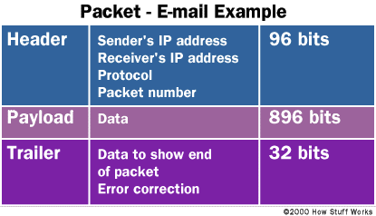

# Q1	
**Research the development of the internet from 1980 to today. You must describe at least FIVE key events in the development of the internet. You can refer to events, people of significance, or technologies and how they have changed over time.	300 - 500**

---
The internet development started nearly fifty years back with he U.S. military's funding of a research network called Arpanet in 1969. Many of the researchers who worked on ARPANET made significant contributions to the evolution of the Internet, including Leonard Kleinrock, inventor of packet switching (a basic Internet technology). Vinton Cerf and Robert Kahn invented TCP/IP protocol in the 1970s, and in 1972, Ray Tomlinson introduced network email.

- In 1984, the Internet's Domain Name System was created to match complex IP addresses with easy-to-remember names ending in extensions such as .com, .org, .edu, .gov, .mil and country codes including .de for Germany. 

- In 1989 @The World (http://world.std.com/) became the first commercial Internet Service Provider which provided access to the internet for the general public via dial-up network service.

- In 1990, Tim Berners-Lee invented the World Wide Web as a method of publishing information in a hypertext format on the Internet. 

- In 1993, computer science student Marc Andreessen created the first popular Web browser, known as Mosaic. The Mosaic browser contributed to very fast spread of the World Wide Web. Since then the number of Web sites and Web pages has exploded.

- By 1987, the number of hosts on internet exceeded 20,000 nodes at the same time Cisco shipped it's first router.

- In 1997, the 802.11 standard (the standards that makes WiFi feasible) was established. Vic Hayes has been credited as the "father of Wi-Fi" because he chaired the IEEE committee that created the 802.11 standards. At about the same time, Commonwealth Scientific and Industrial Research Organisation (CSIRO) of Australia invented a chip that greatly improved the signal quality of WiFi. CSIRO credits the following inventors for creating the technology: Dr. John O’Sullivan, Dr. Terry Percival, Mr. Diet Ostry, Mr. Graham Daniels, and Mr. John Deane.

- In 1998, the Internet Protocol version 6 was introduced, to allow for future growth of Internet Addresses. The current most widely used protocol is version 4. IPv4 uses 32-bit addresses allowing for 4.3 billion unique addresses; IPv6, with 128-bit addresses, will allow 3.4 x 1038 unique addresses, or 340 trillion trillion trillion addresses.
# Q2
**Define the features of the following technologies that are essential in terms of the development of the internet:**

  - packets
  - IP addresses (IPv4 and IPv6)
  - routers and routing
  - domains and DNS
---
  1. _**Packets**_
    Everything we do on the interent involves packets. All information sent over internet is broken into small pieces and then sent across the internet as a series of "Packets". A packet is nothing but small part of the information sent from a device to another over the internet. Networks that ship data around in small packets are called **packet switched networks**.

  Each packet carries the information that will help it get to its destination. Most network packets are split into three parts as described below:
    
    
*Image source: https://computer.howstuffworks.com/question5251.htm*
    
  - **Header** The header contains instructions about the data carried by the packet. These instructions may include:
      - *Length of packet* (some networks have fixed-length packets, while others rely on the header to contain this information)
      - *Synchronization* (a few bits that help the packet match up to the network)
      - *Packet number* (which packet this is in a sequence of packets)
      - *Protocol* (on networks that carry multiple types of information, the protocol defines what type of packet is being transmitted: e-mail, Web page, streaming video)
      - *Destination address* (where the packet is going)
      - *Originating address* (where the packet came from)
  - **Payload** - Also called the body or data of a packet. This is the actual data that the packet is delivering to the destination. If a packet is fixed-length, then the payload may be padded with blank information to make it the right size.

  - **Trailer** - The trailer, sometimes called the footer, typically contains a couple of bits that tell the receiving device that it has reached the end of the packet. It may also have some type of error checking. The most common error checking used in packets is *Cyclic Redundancy Check (CRC)*. CRC is pretty neat. Here is how it works in certain computer networks: It takes the sum of all the 1s in the payload and adds them together. The result is stored as a hexadecimal value in the trailer. The receiving device adds up the 1s in the payload and compares the result to the value stored in the trailer. If the values match, the packet is good. But if the values do not match, the receiving device sends a request to the originating device to resend the packet.

2. _**IP addresses (IPv4 and IPv6)**_ An Internet Protocol address (IP address) is a logical numeric address that is assigned to every single computer, printer, switch, router or any other device that is part of a TCP/IP-based network. It is used to uniquely identify every node in the network.

    Two versions of the Internet Protocol are in common use in the Internet today. The original version of the Internet Protocol that was first deployed in 1983 in the ARPANET, the predecessor of the Internet, is Internet Protocol version 4 (IPv4). The rapid exhaustion of IPv4 address space available for assignment to Internet service providers and end user organizations by the early 1990s, prompted the **Internet Engineering Task Force (IETF)** to explore new technologies to expand the addressing capability in the Internet. The result was a redesign of the Internet Protocol which became eventually known as Internet Protocol Version 6 (IPv6) in 1995.IPv6 technology was in various testing stages until the mid-2000s, when commercial production deployment commenced.

- *IPv4 addresses*
  The traditional IP Address (known as IPv4) uses a 32-bit number to represent an IP address. An IP address is written in "dotted decimal" notation, which is 4 sets of numbers separated by period each set representing 8-bit number ranging from (0-255). An example of IPv4 address is 216.3.128.12.

  An IPv4 address is divided into two parts: network and host address. The network address determines how many of the 32 bits are used for the network address and the remaining bits are used for the host address. The host address can further divided into subnetwork and host number.

  As mentioned earlier, IPv4 addresses is 32-bit number which means it is capable of providing roughly 4 billion unique numbers, and hence IPv4 addresses has run out by the year 2011 as more devices are connected to the IP network.
- *IPV6 addresses* In IPv6, the address size is increased from 32 bits in IPv4 to 128 bits. This much of extra bits can provide approximately 3.403×1038 different combinations of addresses. This is deemed sufficient for the foreseeable future.

  The intent of the new design was not to provide just a sufficient quantity of addresses, but also redesign routing in the Internet by allowing more efficient aggregation of subnetwork routing prefixes.

  3. _**Router and Routing**_ 
  - A *Router* is a hardware device designed to receive, analyze and move incoming packets to another network. It may also be used to convert the packets to another network interface, drop them, and perform other actions relating to a network.

    Routers can analyze the data being sent over a network, change how it is packaged, and send it to another network or over a different network. For example, routers are commonly used in home networks to share a single Internet connection between multiple computers.
  - *Routing* refers to establishing the routes that data packets take on their way to a particular destination. Routing can  take place within a proprietary network or over the internet. 

    In general, routing involves the network topology, or the setup of hardware, that can effectively relay data. Standard protocols help to identify the best routes for data and to ensure quality transmission. Individual pieces of hardware such as routers are referred to as "nodes" in the network. Different algorithms and protocols can be used to figure out how to best route data packets, and which nodes should be used.

  4. _**Domains and DNS**_
  - The term *Domain* can refer either to a local subnetwork or to descriptors for sites on the internet.
    - *Local subnetwork domains*: On a local area network (LAN), a domain is a subnetwork made up of a group of clients and servers under the control of one central security database. Within a domain, users authenticate once to a centralized server known as a domain controller, rather than repeatedly authenticating to individual servers and services. Individual servers and services accept the user based on the approval of the domain controller.
    - *Internet domains*: On the internet, a domain is part of every network address, including website addresses, email addresses, and addresses for other internet protocols such as FTP, IRC, and SSH. All devices sharing a common part of an address, or URL, are said to be in the same domain.
    
      To obtain a domain, you must purchase it from a domain registrar. Internet domains are organized by level. Most people are familiar with the Top Level Domains (TLDs) of .com, .edu, .net, and .org. TLDs are the most general and basic part of the URL. There are actually many top level domains.  Every country is assigned one; for example: for Australia ".au" is the contry code for the top level domain.
  
  - The *Domain Name System (DNS)* translates internet domains and hostnames to IP addresses and vice versa. On the internet, DNS automatically converts between the names typed in the address bar of a web browser to the IP addresses of web servers hosting those sites. Larger corporations use DNS to manage a company intranet. Home networks use DNS to access the internet but do not use it to manage the names of home computers.

    DNS is a client/server network communication system. DNS clients send requests to and receive responses from DNS servers. Requests containing a name that results in an IP address being returned from the server are called forward DNS lookups. Requests that contain an IP address and result in a name, called reverse DNS lookups, are also supported. DNS implements a distributed database to store this name and last-known address information for all public hosts on the internet.

**Explain how each technology has contributed to the development of the internet.	50 - 100 words per dot point**
# Q3
**Define the features of the following technologies that are essential in terms of the development of the internet:**
  - TCP
  - HTTP and HTTPS
  - web browsers (requests, rendering and developer tools)

  ---
  

**Explain how each technology has contributed to the development of client and server communication over the internet	50 - 150 words for each technology**

---
  1. Its features essential in development of internet
  2. How it contributed to the development of client and server communication.

- TCP
    
    Transmission control protocol (TCP) is a network communication protocol designed to send data packets over the Internet.

    Transmission Control Protocol is one of the most used protocols in digital network communications and is part of the Internet protocol suite, commonly known as the TCP/IP suite. Primarily, TCP ensures end-to-end delivery of data between distinct nodes. TCP works in collaboration with Internet Protocol, which defines the logical location of the remote node, whereas TCP transports and ensures that the data is delivered to the correct destination.

    Before transmitting data, TCP creates a connection between the source and destination node and keeps it live until the communication is active. TCP breaks large data into smaller packets and also ensures that the data integrity is intact once it is reassembled at the destination node.

- HTTP and HTTPS
  
    HTTP and HTTPS are both responsible for providing a channel where data can be transmitted between a user's device and a web server so that normal web browsing functions can take place.

    HTTP stands for HyperText Transfer Protocol, and it's the network protocol used by the World Wide Web that lets you open web page links and jumps from one page to the next across search engines and other websites.

    When a web page that uses HTTP is requested by a user, the web browser uses the HyperText Transfer Protocol (over port 80) to request the page from the webserver. When the webserver receives and accepts the request, it uses the same protocol to send the page back to the client.

    This protocol is the foundation for large, multi-functioning, multi-input systems — like the web. The web as we know it wouldn't function without this bedrock of communication processes, as links rely on HTTP in order to work properly.

  However, HTTP sends and receives data in plaintext. This means that when browsing a website that uses HTTP, anyone listening in on the network can see everything that's being communicated between the client browser and the server. This includes passwords, messages, files, etc.

  HTTPS is very similar to HTTP, with the key difference being that it is secure, which is what the **s** at the end of HTTPS stands for.

  HyperText Transfer Protocol Secure uses a protocol called SSL (Secure Sockets Layer) or TLS (Transport Layer Security), which essentially wraps the data between the client browser and the server in a secure, encrypted tunnel over port 443. This makes it much harder for packet sniffers to decipher, unlike HTTP.

  TLS and SSL are especially useful when shopping online to keep financial data secure, but is also used on any website that requires sensitive data (e.g., passwords, personal information, payment details).

  Another benefit of HTTPS over HTTP is that it's much faster, meaning that web pages load quicker over HTTPS. The reason for this is because HTTPS is already understood to be secure, so no scanning or filtering of data has to take place, resulting in less data being transferred and ultimately quicker transfer times.


- web browsers (requests, rendering and developer tools)

  A web browser is a software program that allows a user to locate, access, and display web pages. Browsers are used primarily for displaying and accessing websites on the internet, as well as other content created using languages such as Hypertext Markup Language (HTML) and Extensible Markup Language (XML).

  A variety of web browsers are available with different features, and are designed to run on different operating systems. Common browsers include Internet Explorer from Microsoft, Firefox from Mozilla, Google Chrome, Safari from Apple, and Opera. All major browsers have mobile versions that are lightweight versions for accessing the web on mobile devices.

  Web browsers date back to the late 1980s when an English scientist, Tim Berners-Lee, first developed the ideas that led to the World Wide Web (WWW). This consisted of a series of pages created using the HTML language and joined or linked together with pointers called hyperlinks.

  Mosaic was one of the first browser built by Marc Andreesen in 1993.
# Q4
**Identify THREE data structures used in the Ruby programming language and explain the reasons for using each.	50 - 100 words on each data structure**
---
1. Arrays:

    Ruby arrays are ordered, integer-indexed collections of any object. Each element in an array is associated with and referred to by an index.

    Array indexing starts at 0, as in C or Java. A negative index is assumed relative to the end of the array --- that is, an index of -1 indicates the last element of the array, -2 is the next to last element in the array, and so on.

    Ruby arrays can hold objects such as String, Integer, Fixnum, Hash, Symbol, even other Array objects. Ruby arrays are not as rigid as arrays in other languages. Ruby arrays grow automatically while adding elements to them.

    Arrays are generally used to store list of data into a program.
2. Hash:
    
    A Hash is a collection of key-value pairs like this: "employee" = > "salary". It is similar to an Array, except that indexing is done via arbitrary keys of any object type, not an integer index.

    The order in which you traverse a hash by either key or value may seem arbitrary and will generally not be in the insertion order. If you attempt to access a hash with a key that does not exist, the method will return nil.

    The hashes are mainly used to retrieve the values associated with a key without traversing through entire collection.
3. Integer:
    
    Ruby supports integer numbers. An integer number can range from -230 to 230-1 or -262 to 262-1. Integers within this range are objects of class Fixnum and integers outside this range are stored in objects of class Bignum.

    You write integers using an optional leading sign, an optional base indicator (0 for octal, 0x for hex, or 0b for binary), followed by a string of digits in the appropriate base. Underscore characters are ignored in the digit string.

    You can also get the integer value, corresponding to an ASCII character or escape the sequence by preceding it with a question mark.

# Q5
**Describe the features of interpreters and compilers and how they are different.	100 - 200 words on each way code is executed.**
---
1. Compiler

A compiler is a software program that transforms high-level source code that is written by a developer in a high-level programming language into a low level object code (binary code) in machine language, which can be understood by the computer processor. 
- Compiler analyses entire source code and then generates the binary code if there is no error.
- Compilation process invovles following four steps Scanning, Lexical Analysis, Syntactic Analysis, Semantic Analysis.

2. Interpreter

An interpreter is a computer program that directly executes instructions written in a programming or scripting language, without requiring them previously to have been compiled into a machine language program. As a result of this runtime interpretation, an interpreted program executes more slowly and consumes more resources than an equivalent standalone machine code executable would. 

The difference between an interpreter and a compiler is given below:
| Interpreter                                                                                                      | Compiler                                                                                                                                   |
|------------------------------------------------------------------------------------------------------------------|--------------------------------------------------------------------------------------------------------------------------------------------|
| The machine language code generated by interpreter is executed immediately after the code is interpreted.        | The machine language code generated by the compiler is not executed immediately but stored on computer hard drive as an executable binary. |
| Translates program one statement at a time.                                                                      | Scans the entire program and translates it as a whole into machine code.                                                                   |
| It takes less amount of time to analyze the source code but the overall execution time is slower.                | It takes large amount of time to analyze the source code but the overall execution time is comparatively faster.                           |
| No intermediate object code is generated, hence are memory efficient.                                            | Generates intermediate object code which further requires linking, hence requires more memory.                                             |
| Continues translating the program until the first error is met, in which case it stops. Hence debugging is easy. | It generates the error message only after scanning the whole program. Hence debugging is comparatively hard.                               |
| Programming language like Python, Ruby use interpreters.                                                         | Programming language like C, C++ use compilers.                                                                                            |

# Q6
**Identify TWO commonly used programming languages and explain the benefits and drawbacks of each.	200 - 400 words on each language**
---
1. C#
C# is one of the languages supported by Microsoft .NET framework. The C# language is the preferred architecture for backend programming and automation in Windows environments. 
- Benefits:
  - Its C-style syntax is much more popular with programmers who are used to languages such as Java or C++. Due to this it is very easy to adopt programmers who have experience with other programming languages.
  - It integrates well with Windows. You don't need any special configurations to get a C# program to run in your Windows environment. Whether it's a web application, a Windows service, or a desktop app, C# programs are easily deployed on the network. As long as the target server or workstation supports .NET, your C# program deployment should be a smooth transition from development to production.
  - C# is a compiled language, which means that the code stored on a public-facing server is in binary form. If the server gets hacked, the hacker doesn't automatically have access to the source code, with C#, the hacker must decompile or "crack" the software before the critical components of the program can be exploited.
- Drawbacks
  - Eventhough compiling provides advantages it has its drawbacks as well which are inherited by C# being the compiled language. For example: Since the source code must be compiled each time a change is made, the whole application is required to be deployed again. This often leads to added bugs if a minor change isn't thoroughly tested.
  - Since C# is a part of the .NET framework, the server running the application must support the .Net ecosystem.

2. C Programming
- Benefits
  - Faster app execution: C compiler convets the source code into machine level binary code. This results in efficient program execution since the system can execute the application without need for additional run time to execute the application.
  - Ability to run on minimum hardware: The resultant binary from C program is very light weight application which can run with system with minimal resources. Hence C programming is very useful to create firmware for smart devices.
- Drawbacks
  - Does not support OOPS: C programming language does not support oops (Object Oriented Programming) features which leads to a lot of difficulty in maintaining a large code base.
  - No run time type checking: A C program does not check if valid data type is assigned to a variable or another type during execution of a program instead it does automatic type conversion. This leads to undesired results and complex bugs if programmer is not mindful of the above fact.
  - No Exception Handling: The C compiler checks for syntax errors however there is no provision to handle run time errors. This results in application crashing suddenly if the programmer does handle each run time error.
  - Lack of Garbage Collection: In C programming dynamic memory management is responsibility of the programmer. If the application requests for memory from heap it is responsibility of the programmer to release it at the end of the execution of the program. If memory management is not correctly implemented by a programmer the system may not be able to utilize the resources efficiently and it will result in overall performance degradation of computer system until system restart. 

# Q7
**Identify TWO ethical issues from the areas below and discuss the extent to which an IT professional is ethically responsible in terms of the issue.**

**List of topics containing ethical issues:**
  - access to a user’s personal information (medical, family, financial, personal attributes such as sexuality, religion, or beliefs)
  - intellectual property, copyright, and acknowledgement.
  - criminal acts such as theft, fraud, trafficking and distribution of prohibited substances, terrorism
  - GPS tracking data and other types of metadata, MAC addresses, hardware fingerprints
  - freedom of thought, conscience, speech and the media
  - aggressive sales and marketing practices designed to mislead and deceive consumers
  - trading of shares on the stock exchange OR crypto-currencies

**For each ethical issue identify a source of legal information relating to the ethical issue and discuss whether the law is helpful in assisting a developer to act in an ethical way.**

**Conduct research into a case study of ONE of the ethical issues you have chosen discuss how an ethical IT professional should respond to the case study and how they might mitigate or prevent ethical breaches.	200 - 400 words for each ethical issue**
---
dd
# Q8
**Explain control flow, using an example from the Ruby programming language	100**
---
Control flow is the facility provided by Ruby language to control which part of the code would run based on a specific logical condition.


# Q9
**Explain type coercion	100**

# Q10
**Describe the data types recognised by the Ruby programming language. In your description you should give example code which uses each data type, and include the name of the Ruby classes which represent each data type.	100**
---

# Q11
**Here’s the problem: "There is a restaurant serving a variety of food. The customers want to be able to buy food of their choice. All the staff just quit, how can you build an app to replace them?">**
  - Identify the classes you would use to solve the problem
  - Write a short explanation of why you would use the classes you have identified	100

# Q12
**Identify and explain the error in the following code that is preventing correct execution of the program**
```
celsius = gets
fahrenheit = (celsius * 9 / 5) + 32
print "The result is: "
print fahrenheit
puts "."
```
# Q13
**The following code looks for the first two elements that are out of order and swaps them; however, it is not producing the correct results. Rewrite the code so that it works correctly.**
```
arr = [5, 22, 29, 39, 19, 51, 78, 96, 84]
i = 0
while (i < arr.size - 1 and arr[i] < arr[i + 1])
  i = i + 1 end
puts i
arr[i] = arr[i + 1]
arr[i + 1] = arr[i]
```
# Q14
**Demonstrate your algorithmic thinking through completing the following two tasks, in order:

  i. Create a flowchart to outline the steps for listing all prime numbers between 1 and 100 (inclusive). Your flowchart should make use of standard conventions for flowcharts to indicate processes, tasks, actions, or operations

  ii. Write pseudocode for the process outlined in your flowchart**
# Q15
**Write pseudocode OR Ruby code for the following problem:**

**You have access to two variables: raining (boolean) and temperature (integer). If it’s raining and the temperature is less than 15 degrees, print to the screen "It’s wet and cold", if it is less than 15 but not raining print "It’s not raining but cold". If it’s greater than or equal to 15 but not raining print "It’s warm but not raining", and otherwise tell them "It’s warm and raining".**
# Q16
**An allergy test produces a single numeric score which contains the information about all the allergies the person has (that they were tested for). The list of items (and their value) that were tested are:**

  - eggs (1)
  - peanuts (2)
  - shellfish (4)
  - strawberries (8)
  - tomatoes (16)
  - chocolate (32)
  - pollen (64)
  - cats (128)

**So if Tom is allergic to peanuts and chocolate, he gets a score of 34.**

**Write a program that, given a person’s score can tell them:**

a. whether or not they’re allergic to a given item

b. the full list of allergies.

---
```

allergies = {
    "1": "eggs",
    "2": "peanuts",
    "4": "shellfish",
    "8": "strawberries",
    "16": "tomatoes",
    "32": "chocolate",
    "64": "pollen",
    "128": "cats"
}

def get_name invalid_input=false
    if invalid_input
        puts "Did not get your name. Please try again."
    end
    print "Please enter your name: "
    return gets.chomp
end
user_name = get_name
while user_name == ""
    user_name = get_name true
end

def allergies_list(allergies, invalid_input=false)
    if invalid_input
        puts "Please enter values from given categories only. Please try again."
    end
    puts "Which allergy do you want to test for? "
    puts "Please enter an allergy only from following:  #{allergies.values.map {|a| a.capitalize}.join(", ")}"
    return gets.chomp
end
item = allergies_list(allergies)
while !(allergies.each_value.map {|a| a.upcase}.include? item.upcase)
    item = allergies_list(allergies, true)
end

def input_score invalid_input=false
    if invalid_input
        puts "Only Integer values from 0 to 255 are acceptable. Please try again."
    end
    puts "Please enter your allergy score (Integer value between 0 and 255 both inclusive): "
    return gets.chomp.to_i
end
score = input_score
while score < 0 || score > 255
    score = input_score true
end

if (score > 0)
    s = score
    m = 128

    tested_allergies = []
    while (m > 0)
        if (s/m > 0)
            tested_allergies.push(allergies[m.to_s.to_sym])
            s = s % m        
        end
        m = m/2
    end

    puts "#{user_name} is tested #{tested_allergies.include?(item) ? 'positive' : 'negative'} for #{item} allergy." 

    puts "#{user_name} is allergic to: #{tested_allergies.map {|t| t != nil ? t.capitalize : nil}.join(", ")}" 
else
    puts "#{user_name} is not allergic to anything."
end
```